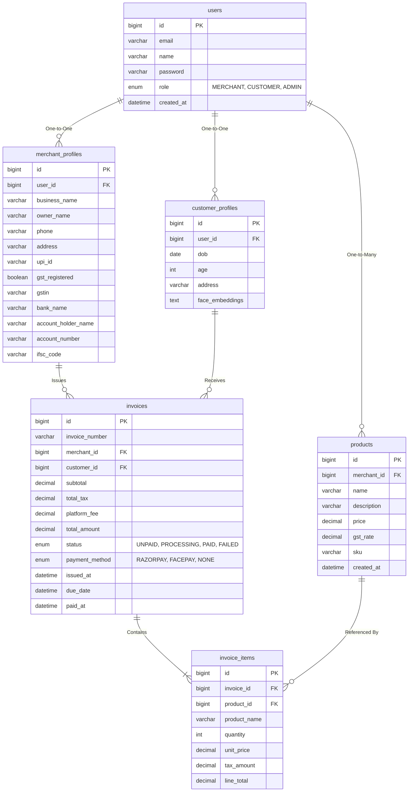

# BillMe Database Schema

## Entity Relationship Diagram (ERD)

## Platform Fee Logic Layer
- **Platform Fee Tracking**: Each `invoice` record natively tracks its own `platform_fee`. At the time of transaction execution, a 1.5% fee is calculated from `total_amount` (or `subtotal` depending on phase configs) and stored immutably against the transaction.
- **Wallet Balances**: The `BalanceSheetService` dynamically sums `(total_amount - platform_fee)` for all `status = PAID` invoices belonging to a specific `merchant_id`. Instead of a rigid `wallet_balance` column that can drift out of sync, it calculates it accurately from raw transactional history.
