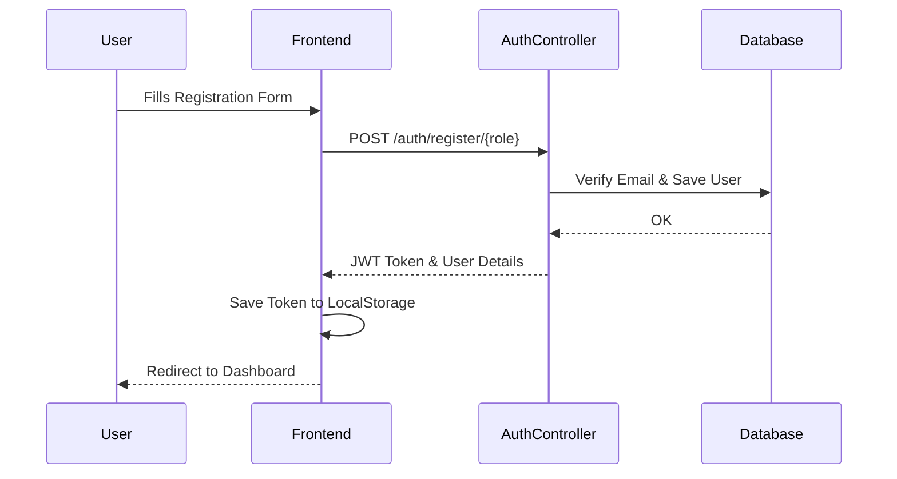
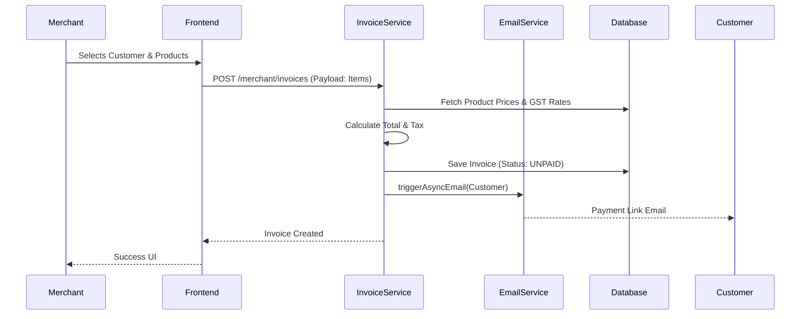
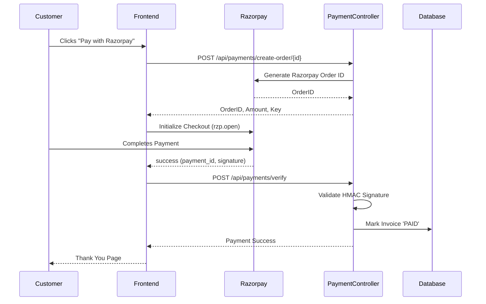
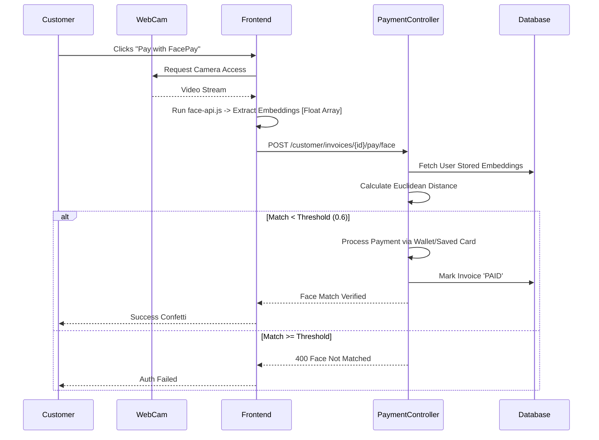
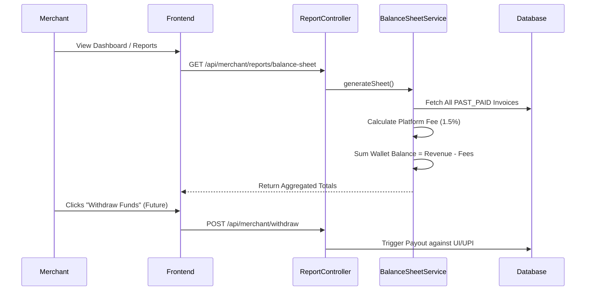

# BillMe System Flows

This document details the critical system flows within the BillMe platform using Mermaid diagrams.

## 1. Authentication & Registration Flow

## 2. Point of Sale (POS) & Invoice Generation Flow

## 3. Standard Payment Flow (Razorpay)

## 4. FacePay Biometric Payment Flow

## 5. Wallet Settlement & Reporting Flow

